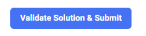

# Meta Hacker Cup γενικές οδηγίες

## Πως γίνονται οι υποβολές:
Σε αυτό το διαγωνισμό τρέχουμε τοπικά τον κώδικα μας. Δηλαδή δεν τον αναιβάζουμε σε OJ (online-judge) όπου και θα μεταγλωτιζόταν και θα έτρεχε στα ανάλογα test cases.

Άρα όταν θέλουμε να υποβάλουμε την λύση μας για ένα πρόβλημα:
1) Πατάμε το κουμπί "Validate Solution and Submit" που βρίσκεται στο κάτω μέρος της σελίδας του προβλήματος. 
2) Πατάμε το κουμπί "Download Validation Input". Αυτό θα μας κατεβάσει σε ένα αρχείο (.txt) την πρώτη ομάδα απο tests cases για 'δοκιμάσουμε' την λύση μας σε πιο εκτεταμένο βαθμό απο ότι με το sample case που μας δίνεται στην εκφώνηση και να δούμε όχι μονο εμείς αλλά και το σύστημα του διαγωνισμού ότι έχουμε μια λύση που το πιο πιθανό (αλλά ΌΧΙ με 100% σιγουρία) θα λύσει το πρόβλημα αφού κατάφερε να λύσει αυτή την πρώτη ομάδα απο ελέγχους.
3) Βρίσκουμε στα Downloads το αρχείο για το πρόβλημα μας (δείτε οδηγίες για configuration του καταλόγου Downloads παρακάτω) το οποίο θα έχει όνομα '\<όνομα\_προβλήματος\>validation\_input.txt' και τρέχουμε την λύση μας με αυτό το αρχείο ως είσοδο και βάζουμε την έξοδο σε ένα άλλο αρχείο για να το υποβάλουμε, π.χ.:

```BASH
g++ my_solution.cpp -o run.out
./run.out < '\<όνομα\_προβλήματος\>validation\_input.txt' > validation_output.txt
```

4) 
