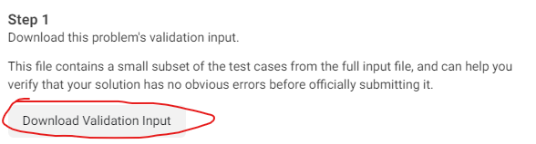
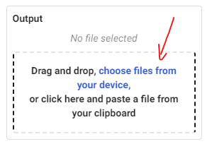
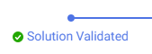
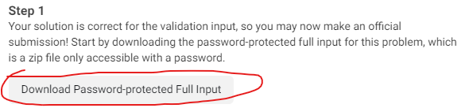
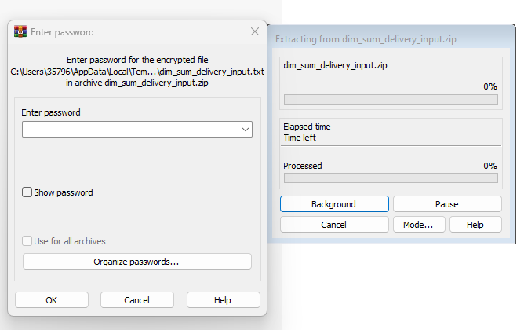
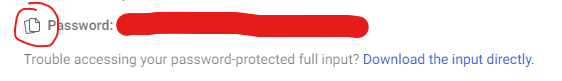
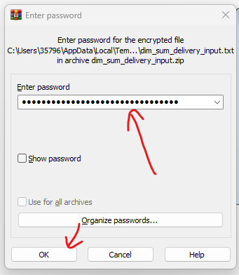
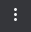
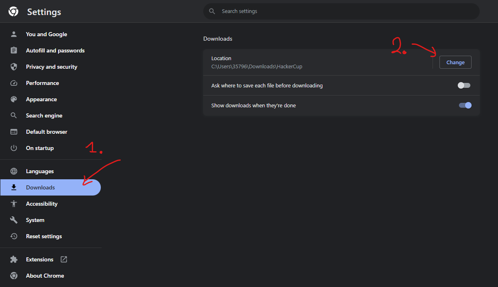
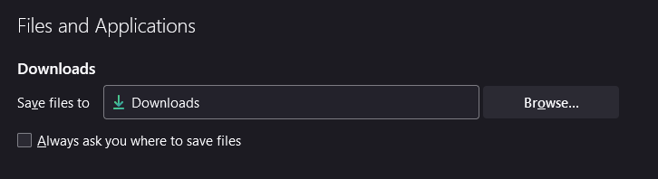

# Meta Hacker Cup
<span class="author">
Author: MavrosOplarxigos
</span>

## Submissions
### Πως γίνονται οι υποβολές:
Σε αυτό το διαγωνισμό τρέχουμε τοπικά τον κώδικα μας. Δηλαδή δεν τον αναιβάζουμε σε OJ (online-judge) όπου και θα μεταγλωτιζόταν και θα έτρεχε στα ανάλογα test cases.

Άρα όταν θέλουμε να υποβάλουμε την λύση μας για ένα πρόβλημα:

1. Πατάμε το κουμπί "Validate Solution and Submit" που βρίσκεται στο κάτω μέρος της σελίδας του προβλήματος.

    

2. Πατάμε το κουμπί "Download Validation Input".

    

    Αυτό θα μας κατεβάσει σε ένα αρχείο (.txt) την πρώτη ομάδα απο tests cases για 'δοκιμάσουμε' την λύση μας σε πιο εκτεταμένο βαθμό απο ότι με το sample case που μας δίνεται στην εκφώνηση και να δούμε όχι μονο εμείς αλλά και το σύστημα του διαγωνισμού ότι έχουμε μια λύση που το πιο πιθανό (αλλά ΌΧΙ με 100% σιγουρία) θα λύσει το πρόβλημα αφού κατάφερε να λύσει αυτή την πρώτη ομάδα απο ελέγχους.

3. Βρίσκουμε στα Downloads το αρχείο για το πρόβλημα μας (δείτε οδηγίες για configuration του καταλόγου Downloads παρακάτω) το οποίο θα έχει όνομα <code>\<problem\_name\>\_validation\_input.txt</code> και τρέχουμε την λύση μας με αυτό το αρχείο ως είσοδο και βάζουμε την έξοδο σε ένα άλλο αρχείο για να το υποβάλουμε, π.χ.:

    ```bash
    g++ my_solution.cpp -o run.out
    ./run.out < 'problem_name_validation_input.txt' > validation_output.txt
    ```

4. Μετά ανεβάζουμε το αρχείο εξόδου (στο παράδειγμα πιο πάνω 'validation\_output.txt') και πατούμε "Validate".

    

    

5. Εαν η έξοδος που έδωσε η λύση μας δεν είναι σωστή τότε θα μας δείξει "Wrong Answer" το παράθυρο που σημαίνει ότι χάνουμε κάποιο(α) απο τα test cases της πρώτης ομάδας και πρέπει να βρούμε ποιες περιπτώσεις χάνει η λύση μας. Διαφορετικά θα μας δείξει "Solution Validated".

    

6. Αν πάρουμε "Solution Validated" τώρα θα μπορούμε να πάμε να τρέξουμε την λύση μας έναντι της 2ης ομάδας απο test cases. Πατούμε "Download Password-protected Full Input".

    

    Αυτό δεν θα ξεκινήσει τον χρόνο των 6 λεπτών ακόμα. Θα κατέβει ένα (.zip) αρχείο το οποίο θα περιέχει μέσα ένα (.txt) αρχέιο. Πρίν προχωρήσουμε στο επόμενο βήμα ανοίγουμε (ή κάνουμε extract) το (.txt) αρχείο μέσα απο ένα όποιοδήποτε (.zip) reader, π.χ. 7-zip ή WinRAR. Θα ανοίξει ένα παράθυρο το οποίο θα περιμένει να δώσουμε ένα password για να δούμε το αρχείο.

    

7. Τώρα είμαστε έτοιμοι να πατήσουμε "Get Password and Start Timer". Μόλις εμφανιστέι o κωδικός πατάμε το κουμπί αντιγραφής του στο clipboard

    

    και πάμε και επικολούμε στο παράθυρο που περιμένει τον κωδικό. Πάτάμε ΟΚ και θα έχουμε πρόσβαση στα περιεχόμενα του αρχείου.

    

    Προτροπή σε αυτό το σημείο είνα να κάνουμε "Save as" το αρχείο ή να το κάνουμε extract απο το λογισμικό ανάγνωσης του (.zip) αντί να το αντιγράφουμε στο clipboard καθώς μπορεί να γίνει κάποιο λάθος και να μην αντιγράψουμε όλα τα περιεχόμενα του αρχείου.

8. Τώρα μπορούμε να τρέξουμε την λύση μας έναντι αυτού του αρχείου εισόδου. Πάλι είναι σημαντικό να βάλουμε την έξοδο μας σε ένα αρχείο, όπως για παράδειγμα κάναμε με το πρώτο αρχείο ελέγχου, καθώς θα χρειαστεί να αναιβάσουμε αρχείο εξόδου.

9. Τώρα αφού έχουμε το αρχείο εξόδου και το αρχείο του κώδικα μας πάμε και τα αναιβάζουμε στο παράθυρο που άνοιξε το σύστημα του διαγωνισμού και πατάμε "submit". Προσοχή στο ότι μέσα στα 6 λεπτά που δίνονται μπορούμε να κάνουμε "submit" πολλές φορές αλλά μόνο η τελευταί φορά θα μετρήσει. Με το πέρας των 6 λεπτών δεν θα μπορούμε να ξανακάνουμε υποβολή για το πρόβλημα. Αν δεν υποβάλουμε κάτι μέσα στα 6 λεπτά και πάλι θα κλειδώσει το πρόβλημα και δεν θα μπορούμε να υποβάλουμε κάτι.

## Downloads
### Πώς αλάζω τον φάκελο/κατάλογο 'Downloads' στο browswer μου:

#### Chrome
Πατούμε το κουμπί με τις 3 τελείες πάνω-δεξιά  -> Settings -> Downloads. Μετά επιλέγουμε ΠΟΥ θέλουμε να κατεβαίνουν τα αρχεία, ούτως ώστε να ευκοληνθούμε κατά την ώρα του διαγωνισμού.



#### Firefox
3 παύλες πάνω-δεξιά -> General -> Files & Applications:



## Tips
- Αν πίασουμε WA στην πρώτη ομάδα απο ελέγχους τότε εννοείτε ότι μπορούμε να πάμε να δούμε ποιες περιπτώσεις χάνουμε ανοίγωντας το αρχείο εισόδου αντί να κάτσουμε να δημιουργήσουμε tests απο το μηδέν. Συνήθως (όχι πάντα) η πρώτη ομάδα ελέγχων περιέχει και test cases μικρού μεγέθους ώστε να μπορούμε να παρατηρήσουμε εύκολα λάθη.
- Για την πρώτη ομάδα ελέγχων δεν δίνεται timer. Άρα μπορούμε να κατεβάσουμε το αρχείο με τους ελέγχους και να βάλουμε μια brute force λύση να παράξει τις λύσεις (μέχρι κάποιο σημείο) ούτως ώστε να βρούμε πιο εύκολα που έχουμε λάθος αφού θα ξέρουμε το σωστό αποτέλεσμα.
- Αν η λύση μας θέλει (π.χ. 1) λεπτό να παράξει το αρχείο εξόδου τότε δεν θα πίασουμε TLE (αφού δεν την τρέχει κάποιος judge). Το μόνο που μας περιορίζει σε θέμα χρόνου είναι το timer των 6 λεπτών. Εμείς πρέπει μέσα σε 6 λεπτά να τρέξουμε την λύση μας στην δεύτερη ομάδα test cases και να ανεβάσουμε το αρχείο εξόδου και το κώδικα μας. Άρα αν υπολογίσουμε ότι η λύση μας θέλει (π.χ. 3 λεπτά) τότε θα είμαστε μέσα στα πλαίσια. Στις πλείστες περιπτώσεις οι χρόνοι εκτέλεσης είναι μικροί (<10 δευτερόλεπτα) απλά εδώ αναφέρνω το πιο ακραίο σενάριο για παράδειγμα.
- Είναι καλά στο template μας που έχουμε να συμπεριλάβουμε το τύπωμα του "Case #" που θέλουν τα προβλήματα του Hacker Cup αντί να το ξαναγράφουμε κάθε φορά για κάθε πρόβλημα, π.χ.:

```CPP

// Ότι άλλο έχετε μέσα στο πρότυπο σας (π.χ. #define ll long long)

void solve(){
	// solve the problem
	cout << answer << endl;
}

int main(){
	int t; // Αριθμός ελέγχων
	cin >> t;
	for(int c=1;c<=t;c++){
		cout << "Case #" << c << ": ";
		solve();
	}
}
```

- Αφού τρέχουμε τοπικά τον κώδικα μας μπορούμε να το εκμεταλευτούμε και να χρησιμοποιήσουμε ότι flags θέλουμε κατα την μεταγλώττιση που μπορεί να βοηθήσουν στην απόδοση του κώδικα μας. Μερικά παραδείγματα είναι τα εξής:

	- Αύξηση του μεγέθους της μνήμης stack:
		
		- Windows: Κάνουμε compile με τα flags <code>-Wl,--stack,268435456</code>. Ο αριθμός 268435456 είναι ο αριθμός σε bytes που θέλουμε να χωρεί το stack μας και μπορούμε να τον αυξήσουμε/μειώσουμε όσο εμείς θέλουμε και όσο μας επιτρέπει η μνήμη του υπολογιστή μας φυσικά. 268435456 bytes = 256 MBs.

		```BASH
		g++ my_code.cpp -Wl,--stack,268435456
		```
 
		- Linux: Εκτελούμε την εντολή <code>ulimit -s unlimited</code>. Αυτή η εντολή θα δώσει σε όλα τα εκτελέσιμα στο terminal που την τρέξαμε απεριόριστη μνήμη (όση μπορεί ο υπολογιστής βέβαια).

		- Πως δοκιμάζουμε ότι η εντολή αύξησης του stack έτρεξε σωστά; Γράφουμε πρόγραμμα που δεσμεύει μνήμη περισσότερη απο ότι θα είχαμε με standard compilation. Π.χ.:
		
		```CPP
		#include <bits/stdc++.h>
		using namespace std;
		int main(){
			int a[10000000LL];
			cout << a[10000000LL-1] << endl;
		}
		```
		
		Εάν πάρουμε αποτέλεσμα απο το πρόγραμμα τότε έχουμε δεσμεύσει περισσότερη μνήμη stack απο ότι χωρίς τις πιο πάνω λύσεις. Διαφορετικά θα πάρουμε σφάλμα όπως για παράδειγμα "0 \[\] a 511 cygwin\_exception::open\_stackdumpfile: Dumping stack trace to a.exe.stackdump" στα Windows αν έχουμε τον cygwin GCC μεταγλωττιστή.

	- Μεγαλύτερο επίπεδο βελτιστοποίησης κατα την μεταγλώττιση:
		- Μεγαλύτερα επίπεδα βελτιστοποίσης κατα την μεταγλώττιση μπορεί να προκαλέσουν την μεταγλώττιση μας να είναι πιο αργή αλλά το εκτελέσιμο που παράγεται να τρέχει πιο γρήγορα.
		- Περισσότερα για τα επίπεδα βελτιστοποιήσεων [εδώ](https://www.linuxtopia.org/online_books/an_introduction_to_gcc/gccintro_49.html)

		```BASH
		# Παράδειγμα μεταγλώττισης με το μέγιστο επίπεδο βελτιστοποίησης:
		g++ -Ofast my_code.cpp
		```

- Επίσης προφανές αλλά το θυμίζω σε αυτό τον οδηγό είναι το ότι αφού ο διαγωνισμός είναι online σε όλες τις φάσεις του (εχτός κάποτε απο τους τελικούς), έχουμε στην διάθεση μας το διαδύκτιο για να ψάξουμε ότι θέλουμε και μπορεί να μην ξέρουμε ή να έχουμε ξεχάσει. Π.χ.: Θυμούμε την έννοια του LCA (lowest common ancestor) στα δέντρα αλλά δεν θυμούμε πως κάνω binary lifting για να τον βρώ τότε δεν είναι λάθος να ψάξω στο διαδύκτιο να βρω πως γίνεται αφού ΌΛΟΙ οι διαγωνιζόμενοι έχουν πρόσβαση το διαδύκτιο. Ανήθικο είναι να χρησιμοποιήσω τον κώδικα κάποιου άλλου διαγωνιζόμενου όχι να βρω πληροφορίες στο διαδύκτιο.


