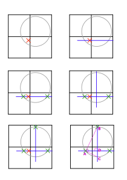

---
tags:
  - Geometry
---
# Battleship

Author: cfalas

## Problem
[Source](http://81.4.170.42:8980/training/#/task/battleship/statement)

Το πρόβλημα μας ζητάει να βρούμε τις συντεταγμένες ενός κρυμένου σημείου, χρησιμοποιώντας queries στα οποία μπορούμε να δώσουμε συντεταγμένες, και μας απαντάει αν η απόσταση από το σημείο που δώσαμε μέχρι το σημείο που ψάχνουμε είναι μικρότερη από το $R$ (το οποίο είναι επίσης άγνωστο).

## Solution
### Subtask 1 (3 points)
- $R = 100$

Αφού το $R$ είναι 100, και ολόκληρος ο κύκλος πρέπει να είναι μέσα στο πλέγμα με διαστάσεις $100 \times 100$, ο κύκλος έχει το κέντρο του αναγκαστικά στο $(0, 0)$.

### Subtask 2 (45 points)
- $R \geq 50$

Στο δεύτερο subtask, το κέντρο του κύκλου μπορεί να είναι στο σημείο $(x, y)$, όπου $0 \leq x, y \leq 50$. Όμως, το γεγονός ότι ο κύκλος είναι μεγάλος μας επιτρέπει αρκετά εύκολα να βρούμε σημεία που βρίσκονται μέσα στον κύκλο.

Έτσι, θα ακολουθήσουμε τα ακόλουθα βήματα, όπως φαίνονται και στην εικόνα πιο κάτω:

1. Βρίσκουμε ένα σημείο μέσα στον κύκλο
2. Τραβούμε μια οριζόντια γραμμή η οποία να περνάει από το σημείο που βρήκαμε
3. Βρίσκουμε τα σημεία στα οποία τέμνονται η γραμμή με τον κύκλο, κάνοντας binary search με τα queries (αν το σημείο βρίσκεται μέσα στον κύκλο πάμε πιο μακρυά, αλλιώς πιο κοντά). Τα ονομάζουμε $(x_1, y_1)$ και $(x_2, y_2)$ αντίστοιχα.
4. Μπορούμε να χρησιμοποιήσουμε το γεγονός ότι η μεσοκάθετος δύο σημείων πάνω στον κύκλο περνά από το κέντρο του κύκλου. Έτσι, βρίσκουμε την μεσοκάθετο (η οποία είναι πάντα) μια κατακόρυφη, η οποία έχει $x=\frac{1}{2}(x_1+x_2)$.
5. Βρίσκουμε το σημείο (ένα από τα δύο, για παράδειγμα αυτό που έχει $y>y_1$) στο οποίο τέμνεται η μεσοκάθετος με τον κύκλο.
6. Έχουμε 3 σημεία πάνω στον κύκλο που ψάχνουμε, τα οποία είναι αρκετά για να περιγράψουμε μοναδικά τον κύκλο που ψάχνουμε, άρα και για να βρούμε το κέντρο του. Μπορούμε να δούμε ότι τα τρίγωνα $ABC$ και $DBA$ (στο σχήμα πιο κάτω) είναι όμοια, και ότι $BC=2 \cdot R$. Δηλαδή, $R = \frac{1}{2} \cdot BC = \frac{(AB)^2}{2 \cdot BD}$. Μπορούμε να βρούμε την απόσταση $AB$ χρησιμοποιώντας το Πυθαγόρειο θεώρημα. Αφού βρούμε το $R$, ξέρουμε ότι το κέντρο του κύκλου βρίσκεται στο $(\frac{1}{2}(x_1+x_2), y_3-R)$

Άρα αρκεί για να λύσουμε το πρόβλημα να βρούμε ένα σημείο μέσα στον κύκλο. Αφού το $R$ είναι αρκετά μεγάλο, είναι αρκετό να δοκιμάσουμε μερικά σημεία, και είναι εγγυημένο ότι τουλάχιστο ένα από αυτά είναι μέσα στον κύκλο:

- $(0, 0)$
- $(-50, -50)$
- $(-50, 50)$
- $(50, -50)$
- $(50, 50)$

### Subtask 3 (52 points)
Μπορούμε να χρησιμοποιήσουμε την ίδια λύση και για το 3ο subtask, αλλά πρέπει να βρούμε τρόπο να "ψάχνουμε" τον κύκλο, το οποίο είναι αρκετά πιο δύσκολο και χρειάζεται αρκετά περισσότερα queries λόγω του μικρότερου μεγέθους του κύκλου.

Υπάρχουν πολλές διαφορετικές λύσεις, οι οποίες δίνουν διαφορετική βαθμολογία. Θα εξηγήσουμε 3 διαφορετικές, οι οποίες παίρνουν η καθεμια περισσότερους πόντους από την προηγούμενη. Και στις 3 λύσεις αφού βρούμε ένα σημείο μέσα στον κύκλο μπορούμε να ακολουθήσουμε τα ίδια βήματα με το subtask 2 για να βρούμε το κέντρο του κύκλου.

#### Solution 1
Η πρώτη λύση, και η πιο απλή, είναι να δημιουργήσουμε ένα πλέγμα, το οποίο να κάνει query σε όλα τα $x$ και $y$ τα οποία είναι πολλαπλάσια του ελάχιστου $R$. Αυτό, στην χειρότερη περίπτωση, θα μας βρει ένα σημείο μέσα στον κύκλο χρησιμοποιώντας $\lceil \frac{2 \cdot 100}{R_{min}} \rceil ^2= 784$ queries.

Μπορείτε να δείτε ότι δεν μπορείτε να μετακινήσετε τον κύκλο έτσι ώστε κανένα σημείο να μην είναι μέσα στον κύκλο (τα σημεία που φαίνονται είναι τα σημεία τα οποία θα ελέγξουμε.
<iframe src="https://www.desmos.com/calculator/tqjeedb1i1?embed" width="700" height="700" style="border: 1px solid #ccc" frameborder=0></iframe>
#### Solution 2 

Η προηγούμενη αν και απλή, δεν είναι βέλτιστη. Μπορούμε να αφαιρέσουμε τα μισά σημεία χωρίς να χάσουμε την δυνατότητα να βρίσκουμε οποιοδήποτε κύκλο. Συγκεκριμένα, θα δημειουργήσουμε δύο πλέγματα, τα οποία έχουν κενό $2R$ μεταξύ των σημείων τους, και θα τα τοποθετήσουμε offset κατά $(R, R)$ το ένα από το άλλο. Έτσι, υπάρχει πιθανότητα κάποιος κύκλος να δεν είναι σε κανένα σημείο του ενός πλέγματος, αλλά σε αυτές τις περιπτώσεις θα είναι σίγουρα σε κάποιο σημείο του δεύτερου πλέγματος.

Μπορείτε να δείτε ότι δεν μπορείτε να μετακινήσετε τον κύκλο έτσι ώστε κανένα σημείο να μην είναι μέσα στον κύκλο (τα σημεία που φαίνονται είναι τα σημεία τα οποία θα ελέγξουμε.
<iframe src="https://www.desmos.com/calculator/xl6sptldjv?embed" width="700" height="700" style="border: 1px solid #ccc" frameborder=0></iframe>

Με αυτό τον τρόπο, χρησιμοποιούμε τα μισά queries, δηλαδή $392$.
#### Solution 3 (Full score)

Μπορούμε να καταλάβουμε ότι ούτε η προηγούμενγ μας λύση δεν είναι βέλτιστη αν σκεφτούμε το πρόβλημα με έναν διαφορετικό τρόπο. Σε κάθε σημείο που έχουμε στις λύσεις πιο πάνω, σκεφτείτε το κάθε σημείο σαν ένα κύκλο με ακτίνα $R$. Θέλουμε να επιλέξουμε τα σημεία έτσι ώστε όλο το πλέγμα να καλύπτεται από τουλάχιστο ένα κύκλο, και θέλουμε να ελαχιστοποιήσουμε το συνολικό εμβαδό των κύκλων.

Αυτό είναι αρκετά κοντά στο [circle packing problem](https://en.wikipedia.org/wiki/Circle_packing), με την διαφορά ότι στο circle packing πρέπει να μειώσουμε τον κενό χώρο μεταξύ κύκλων που εφάπτονται. Ωστόσο, μπορούμε να χρησιμοποιήσουμε την ίδια λύση για να κάνουμε κάτι καλύτερο. Η ιδέα είναι να εγγράψουμε ένα ισόπλευρο τρίγωνο μέσα στον κύκλο, και να χρησιμοποιήσουμε το ισόπλευρο τρίγωνο για να γεμίσουμε το πλέγμα, όπως πιο κάτω:

<iframe src="https://www.desmos.com/calculator/vxwgwcrz5c?embed" width="700" height="700" style="border: 1px solid #ccc" frameborder=0></iframe>

Για να υπολογίσουμε το πόσο πρέπει να προσθέτουμε κάθε φορά για να δημιουργήσουμε τα σημεία που πρέπει να κάνουμε query, χρησιμοποιούμε και πάλι το Πυθαγόρειο θεώρημα, όπως πιο κάτω:

$$ \frac{x^2}{4} + \frac{R^2}{4}=R^2 \implies x = \sqrt{3}R$$

### Going further

Παρόλο που καταφέραμε να μειώσουμε τα queries μας κατά πολύ, ούτε η τελευταία λύση είναι βέλτιστη, λόγω του ότι οι συντεταγμένες μας είναι σχετικά μικρές και δεν χωρούν ακέραιο αριθμό κύκλων όπως τους βάλαμε (μπορείτε να δείτε πιο πάνω ότι η τελευταία γραμμή στα δεξιά σχεδόν δεν χρειάζεται) (η προηγούμενη λύση είναι βέλτιστη μόνο για άπειρα πλέγματα). Η βέλτιστη λύση για μικρά πλέγματα είναι διαφορετική για κάθε μέγεθος, και για μικρό αριθμό κύκλων είναι ακανόνιστη. Αν ενδιαφέρεστε μπορείτε να δείτε περισσότερα στις ακόλουθες σελίδες: 

- <https://citeseerx.ist.psu.edu/doc/10.1.1.30.3894>
- <https://erich-friedman.github.io/packing/circovsqu/>

